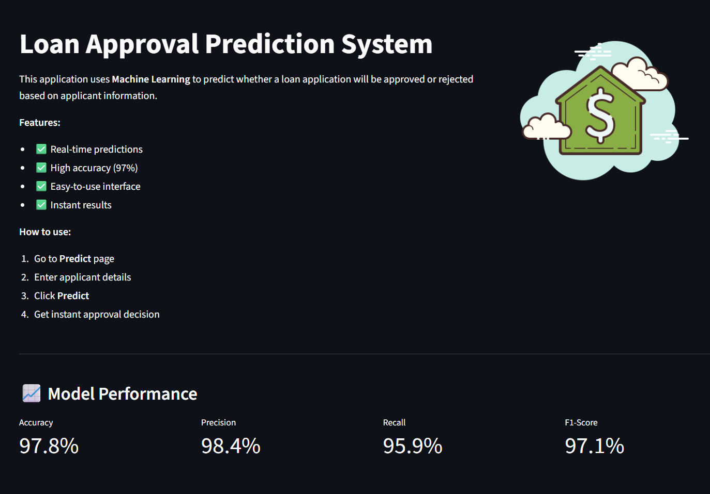
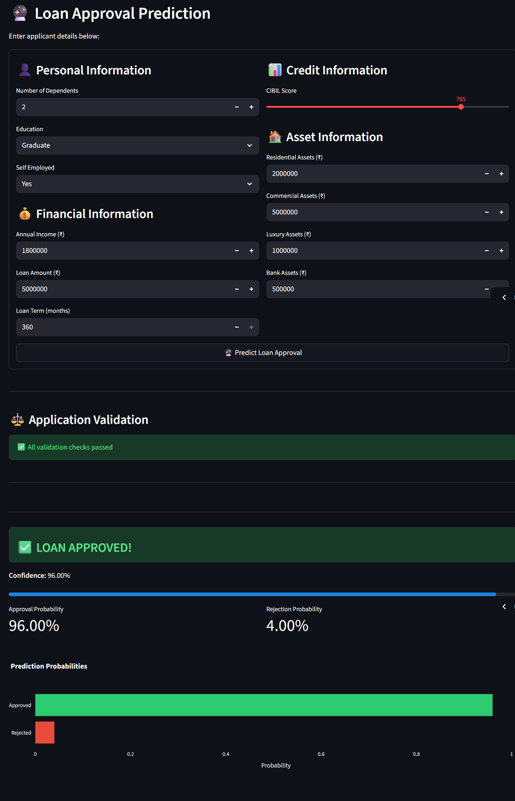
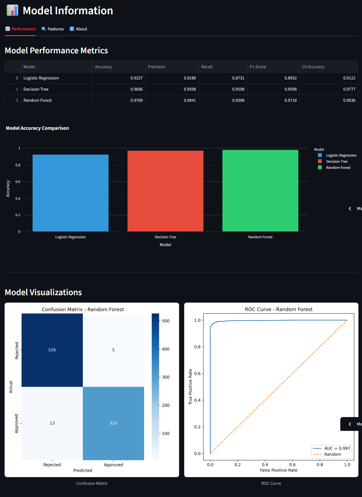

# 🏦 Loan Approval Prediction System

A **Machine Learning web application** that predicts loan approval decisions using a **Random Forest classifier** combined with **banking-grade business rule validation**.
The system demonstrates an **end-to-end ML pipeline**, from data preprocessing to model deployment with an interactive Streamlit UI.

## 🎯 Project Overview

This project combines **machine learning predictions** with **rule-based decision logic** to produce **realistic loan approval outcomes**, similar to real-world banking systems.

### Key Highlights

* **High predictive performance** (Random Forest)
* **Business rule layer** to prevent unrealistic approvals
* **Interactive analytics dashboard**
* **Model explainability** via feature importance
* **Production-ready architecture**

---

## 🚀 Live Demo

🔗 **Streamlit App**

```
https://loan-approval-prediction-gurumahesh23.streamlit.app
```

---

## 📸 Application Screenshots
<p align="center">
 <br>
<em>Home Dashboard</em>
</p>
<p align="center">
 <br>
<em>Loan Prediction Interface</em>
</p>
<p align="center">
 <br>
<em>Model Analytics</em>
</p>

---

## ✨ Core Features

### 🤖 Machine Learning

* Algorithms evaluated:

  * Logistic Regression
  * Decision Tree
  * Random Forest
* **Best Model**: Random Forest
* **Evaluation**:

  * Accuracy
  * Precision / Recall
  * F1-Score
  * ROC-AUC
* **Cross-Validation**: 5-fold Stratified CV

---

### 🛡️ Business Rule Validation (Critical Layer)

Before ML prediction, applications are validated using **domain rules**:

* ❌ Zero or invalid income rejection
* ❌ Loan-to-Income ratio > 5x rejection
* ❌ EMI exceeding 50% of monthly income
* ❌ Very low CIBIL score rejection
* ⚠️ Conditional approval for medium-risk profiles

This ensures **bank-realistic decisions**, not blind ML approvals.

---

### 📊 Analytics Dashboard

* Confusion matrix visualization
* ROC curve with AUC score
* Feature importance ranking
* Model comparison table
* Detailed performance metrics

---

## 📊 Model Performance

| Metric    | Score |
| --------- | ----- |
| Accuracy  | 97.8% |
| Precision | 98.4% |
| Recall    | 95.9% |
| F1-Score  | 97.1% |
| ROC-AUC   | 0.997 |

### Model Comparison

| Model               | Accuracy  | Precision | Recall   | F1       |
| ------------------- | --------- | --------- | -------- | -------- |
| Logistic Regression | 91.3%     | 0.91      | 0.91     | 0.91     |
| Decision Tree       | 93.1%     | 0.93      | 0.93     | 0.93     |
| **Random Forest ⭐** | **97.8%** | **0.98**  | **0.96** | **0.97** |

---

## 🛠️ Tech Stack


### Core

* **Language**: Python 3.8+
* **ML**: scikit-learn
* **Web UI**: Streamlit
* **Data**: pandas, numpy
* **Visualization**: matplotlib, seaborn, plotly

### Dependencies

```txt
pandas
numpy
scikit-learn
matplotlib
seaborn
joblib
streamlit
plotly
```

---

## 📁 Project Structure

```text
loan-approval-prediction/
│
├── app.py
├── dataset/
│   ├── raw/
│   │   └── loan_approval_dataset.csv
│   └── processed/
│       └── loan_data_processed.csv
│
├── notebooks/
│   └── loan_approval_analysis.ipynb
│
├── outputs/
│   ├── models/
│   │   ├── best_model.pkl
│   │   ├── scaler.pkl
│   │   ├── encoders.pkl
│   │   └── feature_names.pkl
│   ├── figures/
│   │   ├── confusion_matrix_best.png
│   │   ├── roc_curve.png
│   │   ├── feature_importance.png
│   │   └── model_comparison.png
│   └── reports/
│       └── model_comparison.csv
|── webpage_images/
|   ├── home.png
|   ├── predict.png
|   └── model_information.png
├── requirements.txt
└── README.md
```

---

## 🚀 Quick Start

### 1️⃣ Clone Repository

```bash
git clone https://github.com/gurumahesh23/loan-approval-prediction.git
cd loan-approval-prediction
```

### 2️⃣ Create Virtual Environment

```bash
python -m venv venv
source venv/bin/activate   # Linux/Mac
venv\Scripts\activate      # Windows
```

### 3️⃣ Install Dependencies

```bash
pip install -r requirements.txt
```

### 4️⃣ Run Application

```bash
streamlit run app.py
```

Open browser at:

```
http://localhost:8501
```

---

## 🧪 Dataset Information

* **Source**: Kaggle - Loan Approval Prediction Dataset
* **Records**: 4,269
* **Target Variable**: Loan Status (Approved / Rejected)
* **Split**: 80% Train / 20% Test

### Input Features

| Feature                  | Description             |
| ------------------------ | ----------------------- |
| no_of_dependents         | Number of dependents    |
| education                | Graduate / Not Graduate |
| self_employed            | Yes / No                |
| income_annum             | Annual income           |
| loan_amount              | Requested loan          |
| loan_term                | Duration (months)       |
| cibil_score              | Credit score            |
| residential_assets_value | Property value          |
| commercial_assets_value  | Business assets         |
| luxury_assets_value      | Luxury items            |
| bank_asset_value         | Savings                 |

---

## 🔬 Methodology

1. **Preprocessing**

   * Missing value handling
   * Encoding categorical variables
   * Feature scaling

2. **Feature Engineering**

   * Debt-to-Income ratio
   * Total asset value
   * EMI affordability metrics

3. **Model Selection**

   * Trained multiple classifiers
   * Selected Random Forest for stability

4. **Rule-Based Validation**

   * Financial feasibility checks
   * Risk filtering before ML inference

5. **Deployment**

   * Streamlit UI
   * Serialized model artifacts
   * Real-time predictions

---

**Model Limitation** : The model places significant **importance on CIBIL score** due to the characteristics of the underlying dataset, which may not fully reflect real-world banking behavior.
This is mitigated using **business rules**, ensuring balanced decision-making.

---

## 👤 Author

**PATTEM GURU MAHESH**

* GitHub: [https://github.com/gurumahesh23](https://github.com/gurumahesh23)
* LinkedIn: [https://linkedin.com/in/pattemgurumahesh](https://www.linkedin.com/in/pattemgurumahesh/)
* Email: [gurumaheshpattem@gmail.com](mailto:gurumaheshpattem@gmail.com)

---
⭐ If you find this project useful, please consider **starring the repository**.
